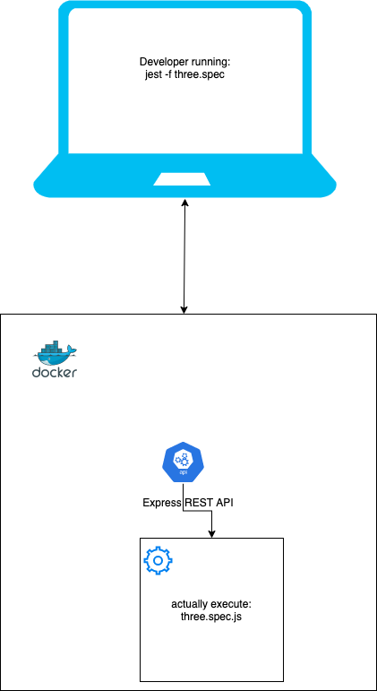

# We are the Sled team 🛷
We're an infrastructure team developing tools for all the FEDs at Wix.
Our main focus is sled, highly scalable, cloud based system to parallelize jest execution.

More about sled:

[](https://www.youtube.com/watch?v=hbz63Ve-eIY)

https://www.youtube.com/watch?v=hbz63Ve-eIY


# Exercise
The goal of this exercise is to learn&apply concepts to solve a loosely defined task.

In this exercise you will build a little demo of a "mini sled".
Just like the real sled, we'd like it to be built on top of [jest](https://github.com/facebook/jest) test runner.
You can learn on some of jest's architecture in this [video](https://www.youtube.com/watch?v=3YDiloj8_d0), the gist of it is that jest is a modular system,
each of it's parts can be replaced, example of such systems: [resolver](https://jestjs.io/docs/en/configuration#resolver-string), [transformer](https://jestjs.io/docs/en/configuration#transform-objectstring-pathtotransformer--pathtotransformer-object), [runner](https://jestjs.io/docs/en/configuration#runner-string), [reporter](https://jestjs.io/docs/en/configuration#reporters-arraymodulename--modulename-options), etc.

The end goal is to make jest tests execute on another computer instead of the computer that actually invokes jest (the computer that runs `npm test`).

In this repository, you can see a directory called `some-project`, this project have jest wired, and some tests
can be executed on jest via `npm test` (which is actually just invoking the `jest` command).

To mimick another computer, we'll use a docker container.

## Part 1 - Execute spec files on another computer
Create the facilities necessary to execute the spec files (one.spec.js, two.spec.js, etc.) on the running docker container instead of the "local machine".




You should **not** pre-load the spec files on the remote computer, we will test your solution on a different project than `some-project` with completely different spec files.

Key points of the required flow:
* Developer executing `jest` by running `npm test`
* `jest` process is executing
* `jest` process sending the spec files to "remote machine" (either one by one, or all of them together (consider the trade offs))
* "remote machine" executing jest on the remote computer and feeds it the spec files
* "remote machine" sends back the results to the local `jest` process that displays the results.

## Part 2 - Allow debugging spec files while they're being executed on another computer
Create the facilities necessary to debug the remotely executed spec file.
Start by reading node's debugger [documentation](https://nodejs.org/en/docs/guides/debugging-getting-started/).
For example, if the user (developer), wants to debug his spec file, the developer might execute:
```shell
DEBUG=true jest -f one.spec
```
After putting a `debugger;` statement at the place where she wants the debugger to stop.
A javascript debugger would open and the developer would be able to step over/into the code in the spec file (in the example `one.spec.js`)


Please note: we don't want you to implement the UI of the debugger, use one of the existing clients.
You can also piggy back on the chrome's debugger UI, example:
```shell
# Start chrome with remote debugger
/Applications/Google\ Chrome\ Canary.app/Contents/MacOS/Google\ Chrome\ Canary --remote-debugging-port=9222

# Grab the correct page identifier with some jq and sed magic and open the browser on the chrome's debugger UI
open https://chrome-devtools-frontend.appspot.com/serve_file/@65d20b8e6b1e34d2687f4367477b92e89867c6f5/inspector.html?`curl --silent localhost:9222/json | jq -r '.[] | select(.type=="page") | .webSocketDebuggerUrl' | sed -e "s/:\/\//=/g"`\&experiments=true\&remoteFrontend=true
```

* Bonus: Make part 2 without exposing additional port(s) on the docker container, you can, however, create additional docker containers. This is to mimick that the "remote machine" and the "local machine" are both behind firewall(s), but still can access a 3rd machine, a "jump host".


## Initial setup
* Install docker, follow the instructions [here](https://docs.docker.com/get-docker/). To learn more about docker check out [this video](https://www.youtube.com/watch?v=JSLpG_spOBM).
* We've attached a Dockerfile, that is used to build a docker image from which you run a docker container that simulates the remote machine. At the moment it's a simple http server that returns `Hello world` when you issue a GET request to port 8080. You can and should change that application to complete the task.
* To build and run the docker container, follow README.md in the `remote-machine` directory.


## Tips
* Take the time to get a little familiaraty with [node.js](https://nodejs.dev/learn), the [npm package manager](https://nodejs.dev/learn/an-introduction-to-the-npm-package-manager), [promises](https://nodejs.dev/learn/understanding-javascript-promises) and [async / await](https://nodejs.dev/learn/modern-asynchronous-javascript-with-async-and-await)
* Create a simple nodejs app and test it with [jest test runner](https://jestjs.io/docs/en/getting-started)
* [ndb](https://github.com/GoogleChromeLabs/ndb) is an improved debugging experience for Node.js
* Don't start writing any code for the task before you've checked the linked resources, they're here to help you on your quest.


# Before Submitting
* Make sure to use clean code. (References: [Clean Code: A Handbook of Agile Software Craftsmanship](https://www.amazon.com/Clean-Code-Handbook-Software-Craftsmanship/dp/0132350882), [Code Complete](https://www.amazon.com/Code-Complete-Practical-Handbook-Construction/dp/0735619670/) ). Make use of tools that will help you with standard [formatting](https://prettier.io/) an [linting](https://eslint.org/).
* You will be required to explain your implementation, make sure you understand all of your code.

# Submitting your project
The final result is a code that consists of a "client" (a modified jest (or jest subsystem)) and a "server" ("remote machine").

After you've completed your tasks, and you are ready to submit it, do the following:
* Create a **private** git repository (preferably on github.com)
* Make sure all the code is committed and pushed
* Make sure you added a markdown file (`README.md`) with instructions on how to run your project from scratch, that must include any operations that is required in order to run the project
* Clone your repo and use your instructions to see it works as expected
* Add `yurynix` user to the repo (Master permission)
* Send us an email with your repo link


Good luck,

The sledders.

